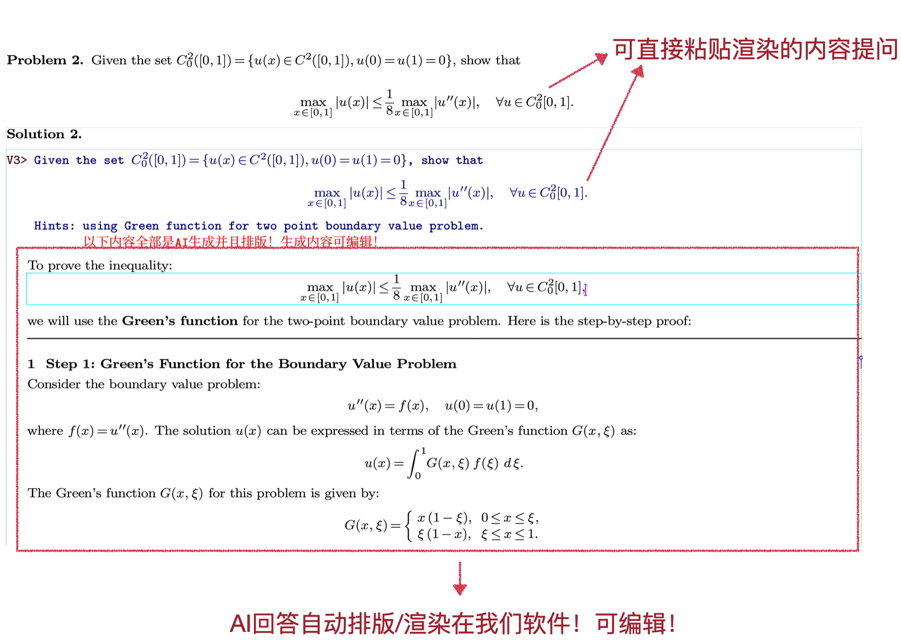

# AI Large Model Integration Feature Usage Guide

Mogan does not support large model integration. However, our semi-open source [Liii STEM](https://liiistem.com/) has built-in large model plugins.

## Text, Math, Tables, etc. as Input

### Inserting a Large Model Block

You can insert a large model block (Session) by following the diagram below:


Most web-based large models only support plain text input. However, in Liii STEM, you can use **any** rendered format as input for the large model.Your input will be highlighted in blue when sent to the model. As shown below:


This feature supports not only mathematical formulas but also tables, as shown below:


## Editable LLM Output

A common issue when using large models is organizing, archiving, and asking follow-up questions based on the model's responses.

The output of the large model integrated into Liii STEM can be rendered directly within Liii STEM, allowing you to edit and modify it easily. As shown below, you can use Liii STEM to automatically generate quizzes and homework answers:




## Using Files as LLM Input

When using large models, we often need to analyze or process existing documents. Liii STEM supports reading files directly as input content for the LLM.

### Usage

Use the following syntax to include a file:
```
%include /path/to/your/file
```

For example:


Note: The path supports absolute paths. The file content will automatically be used as the input content for the LLM.


## FAQ

Q: Can I use Chinese for questions and answers?
A: Yes, you need to set the document language to Chinese.